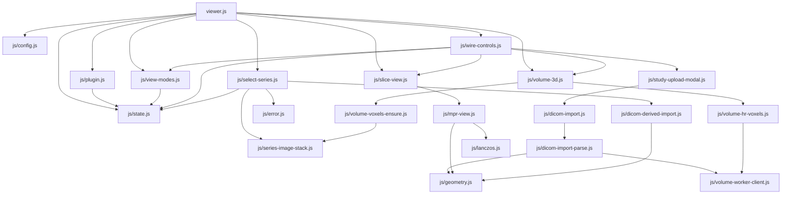
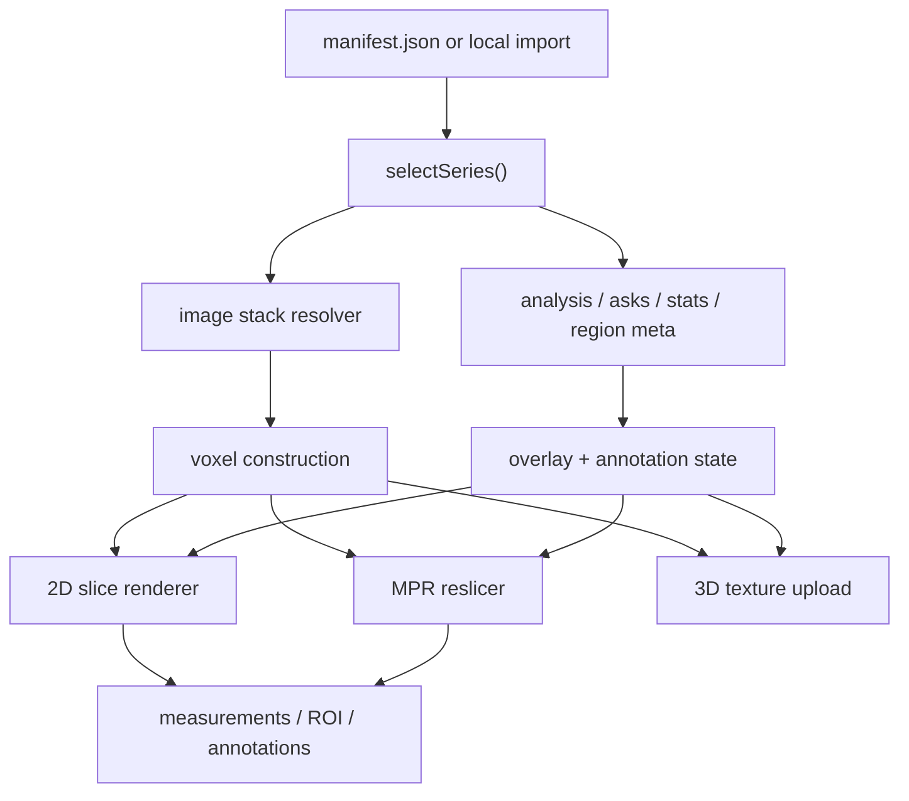

# Architecture

VoxelLab is a local-first research viewer for medical image volumes. The codebase is intentionally split into a small number of reusable layers so geometry correctness lives in one place instead of being reimplemented per feature.

The architecture has a deliberately strong center and a broader edge:

- Core path: local/browser viewing, shared geometry, measurements, compare, overlays, and volumetric rendering.
- Advanced path: optional Python processing, Modal/R2 jobs, calibrated projection reconstruction, calibrated ultrasound scan conversion, and broader DICOMweb-derived-object interoperability.
- Design intent: keep one geometry contract across both paths, but treat the advanced path as a narrower environment and interoperability surface than the core viewer.

## System Shape

- Browser viewer: `index.html`, `viewer.js`, and `js/` render 2D slices, MPR, 3D, overlays, measurements, compare mode, and local imports.
- Shared geometry contract: [`js/geometry.js`](js/geometry.js) and [`geometry.py`](geometry.py) define patient-space ordering, spacing, affine construction, and compare grouping.
- Local Python tooling: converters, segmentation helpers, biomarkers, registration, and data preparation consume the same geometry contract.
- Optional cloud pipeline: `modal_app.py` processes supported CT/MR volumes and calibrated projection/ultrasound jobs, then returns manifest-compatible outputs. This is the advanced engine surface, not the default viewer path.

## Module Dependency Graph



## Data Flow



- Manifest load chooses the current series and establishes the active stack URLs or in-memory images.
- `selectSeries()` loads the visible slice window first, then backfills the rest, and fetches optional sidecars in parallel.
- `ensureVoxels()` builds the shared grayscale label-ready volume for 2D hover, MPR, and 3D. `ensureHRVoxels()` upgrades that path with raw 16-bit data when present.
- 2D rendering applies window/level, colormap, plugin overlays, annotations, and label overlays on the current slice only.
- MPR reuses the same voxel buffers, choosing a fast linear Z path during scrubbing and Lanczos quality on idle.
- 3D uploads only when the underlying voxel data changed; window/level and clipping stay uniform-only updates.
- Measurements, annotations, SEG labels, region overlays, and derived-object bindings all enter after the shared series/voxel selection step rather than inventing parallel data paths.

## State Ownership

| State Group | Primary Writers | Primary Readers |
|---|---|---|
| `manifest`, `seriesIdx`, `sliceIdx` | `viewer.js`, `js/select-series.js`, `js/wire-controls*.js` | nearly all rendering modules |
| `mpr.*` | `js/wire-controls-mpr-panel.js`, `js/sync.js` | `js/mpr-view.js`, `js/slice-view.js` |
| `three.*` | `js/view-modes.js`, `js/wire-controls.js`, `js/volume-3d.js` | `js/volume-3d.js`, clip/readout UI |
| `overlays.*` | `js/select-series.js`, `js/overlay-stack.js`, `js/wire-controls.js` | `js/slice-view.js`, `js/mpr-view.js`, `js/volume-label-overlay.js` |
| `voxels`, `hrVoxels` | `js/volume-voxels-ensure.js`, `js/volume-hr-voxels.js` | `js/slice-view.js`, `js/mpr-view.js`, `js/volume-3d.js` |
| local import caches (`_local*`) | `js/dicom-import.js`, `js/dicom-derived-import.js` | `js/select-series.js`, `js/volume-voxels-ensure.js`, `js/volume-hr-voxels.js` |
| measurements / annotations / ask | `js/measure.js`, `js/annotation.js`, `js/consult-ask.js` | `js/slice-view.js`, side panels, export/report paths |

## Geometry Contract

- The canonical geometry spec lives in [`tests/fixtures/geometry/canonical-cases.json`](tests/fixtures/geometry/canonical-cases.json).
- [`js/geometry.js`](js/geometry.js) and [`geometry.py`](geometry.py) are a dual implementation of that spec, not two independent sources of truth.
- Change order is strict: update the canonical fixture first, then update the JS and Python implementations, then run `npm run check:geometry`.
- [`scripts/check_geometry_parity.mjs`](scripts/check_geometry_parity.mjs) now enforces the shared contract surface and fails if a shared geometry function is added without a matching fixture entry.

## Accuracy-First Rules

- Patient-space geometry is the source of truth. Slice ordering is derived from `ImagePositionPatient` plus `ImageOrientationPatient`, not `InstanceNumber`.
- `FrameOfReferenceUID` is the primary series identity for compare and derived-object alignment.
- MPR and 3D are enabled only for regular Cartesian volumes with enough geometry evidence to reconstruct voxel space honestly.
- Unsupported inputs fail closed instead of being guessed into a volume.

## Supported Volumetric Path

The strongest path today is:

- single-frame CT/MR DICOM slice stacks with valid patient-space geometry
- enhanced multi-frame CT/MR when per-frame geometry and frame payloads can be expanded into the same canonical stack contract
- NIfTI volumes
- manifest-backed derived volumes that already have trustworthy spacing and orientation

Those inputs can participate in:

- 2D slice viewing
- sagittal/coronal/oblique MPR
- 3D volume rendering
- patient-space measurements
- compare mode across compatible series
- local or cloud-derived overlays

## Intentionally Blocked or Limited

- Enhanced multi-frame CT/MR: supported only through the shared frame-expansion path. Irregular stacks, unsupported compressed payloads, or incomplete per-frame metadata stay 2D-only or fail closed.
- Ultrasound / ECHO: raw browser import still stays 2D, but calibrated ultrasound sources can now be routed through the advanced Modal scan-conversion engine to emit a standard derived volume.
- Single projection X-ray: stays 2D.
- Calibrated projection-set reconstruction: supported only through the explicit advanced Modal reconstruction engine with a `voxellab.source.json` calibration manifest.
- DICOMweb / PACS interoperability: WADO-RS metadata normalization, retry/cache-aware metadata fetch, and per-frame adapters now feed both image and session-backed derived-object imports, but this remains an advanced interoperability path rather than a production-complete ingest/auth/cache stack.
- Session-backed derived-object support: SEG can bind into the region overlay slot, CLOSED_PLANAR RTSTRUCT contours can bind as ROIs, VoxelLab-exported viewer-style SR notes with explicit series/slice references can bind as annotations, and RT Dose can bind as persisted metadata when browser storage is available. Dose-grid rendering and full clinical SR/RTSTRUCT/RT Dose round-trip are still incomplete.

## Files That Own Geometry Behavior

- [`js/dicom-import-parse.js`](js/dicom-import-parse.js): browser import classification and DICOM metadata normalization
- [`js/dicomweb/dicomweb-source.js`](js/dicomweb/dicomweb-source.js): WADO-RS metadata normalization plus frame-fetch adapters for the shared import path
- [`js/series-capabilities.js`](js/series-capabilities.js): UI-facing capability gating for MPR/3D
- [`js/derived-objects.js`](js/derived-objects.js): derived-object binding contract and affine/FoR compatibility rules
- [`js/dicom-derived-import.js`](js/dicom-derived-import.js): session-backed SEG / RTSTRUCT / VoxelLab viewer-style SR note import path plus RT Dose metadata binding, all bound to the shared geometry contract
- [`js/ultrasound.js`](js/ultrasound.js): ultrasound cine and scan-conversion boundary rules
- [`js/compare.js`](js/compare.js): compare grouping from canonical patient-space identity
- [`metadata.py`](metadata.py): manifest enrichment for compare and physical metadata
- [`modal_app.py`](modal_app.py): cloud-side normalization and supported processing boundaries
- [`engine_sources.py`](engine_sources.py): calibrated projection and ultrasound source-manifest contracts
- [`projection_reconstruction.py`](projection_reconstruction.py): calibrated projection reconstruction engine with a bundled `itk-rtk` wrapper by default and an explicit override path for external RTK runtimes
- [`ultrasound_reconstruction.py`](ultrasound_reconstruction.py): calibrated ultrasound scan-conversion / reconstruction engine

## Validation

Use these checks before merging geometry or modality changes:

```bash
npm run check
npm run check:geometry
./.venv/bin/python -m pytest -q
node --test tests/*.test.mjs
```

The geometry contract suite exists to keep browser and Python behavior aligned and to ensure unsupported source classes do not quietly claim volumetric capability.
